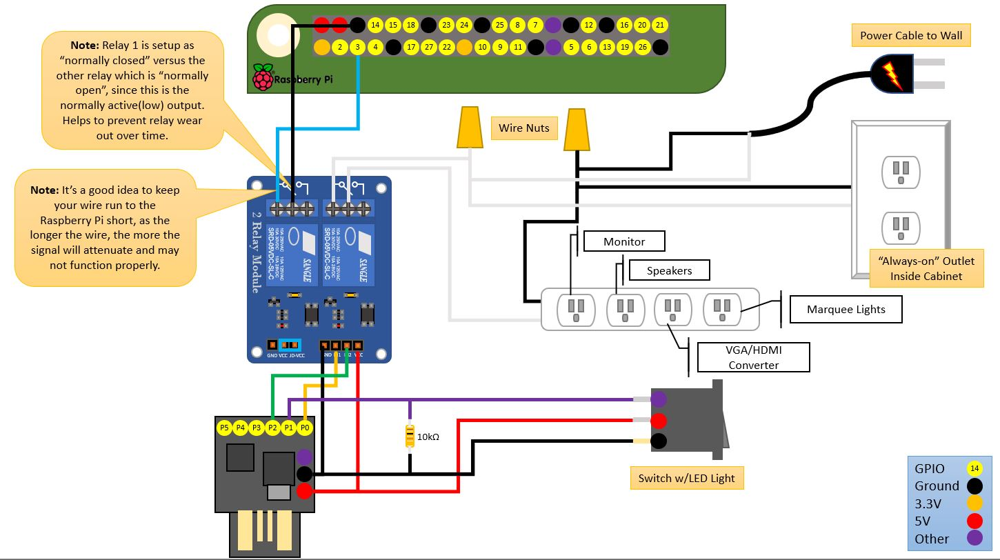

# Arcade Power Control
## DigiSpark (Arduino) Based Power Control for an Arcade Cabinet with RetroPie

***Note:*** *This project is continuously evolving, and thus this readme will likely be improved over time, as I find the inspiration to make adjustments.  That being said, I'm sure there will be many errors that I have overlooked or sections that I haven't updated.*

This project was somewhat inspired by the YouTube series "I Like to Make Stuff", who built an arcade cabinet with motion control power control (https://youtu.be/DVy6U8SdQnI).  Personally, I didn't care for the motion control, but definitely wanted to have a button that could coordinate turning the Raspberry Pi off/on gracefully and also control all of the other components via a switchable power strip.  I happened to have most of the components laying around, so I got to setting it up.

## Hardware

The component list:

* **Raspberry Pi** - (RetroPie) with GPIO 3 available
* **DigiSpark** - The star of the show
* **Switch** - I used a SPST switch with a built-in LED ([Amazon Link](https://www.amazon.com/dp/B012IJ3BBK/ref=cm_sw_em_r_mt_dp_U_YcC7CbAPGBESA)).  I'm not sure I would recommend this switch as it seems to be a little... flaky.  Conceivably you can use any SPST switch, or if you would like you can swap out for a momentary switch and modify the code a little.  
* **10k Ohm Resistor** - For the power switch, to ground.
* **2-Channel Relay** - I used a four channel relay that I had laying around, however a 2-channel should work just as well.  [Amazon Link](https://www.amazon.com/dp/B0057OC6D8/ref=cm_sw_em_r_mt_dp_U_jtppCb3FQ787B)
* **Wire** - Jumper wire and breadboard for connecting things together.
* **Outlet** - Standard Wall Outlet
* **Power Strip** - Standard Power Strip
* **Romex Wire** - Three wire Romex, normally used for home wiring.  
* **Outlet Box** - Tuck those wires away safely.  
* **Grounded Power Plug** - This is the power plug used to connect to the mains power.  You'll need a power cable if you don't already have one laying around.  [Amazon Link](https://www.amazon.com/gp/product/B078N95379)



## Software

The software is pretty simple.  It's one Arduino .ino sketch that is customizable for your rig.  Build and flash your DigiSpark with this sketch and wire it up to the relay to control everything.  

To execute a graceful shutdown on the Raspberry Pi, you will need to make some adjustments to the boot configuration.  I found [this post](https://dzone.com/articles/making-your-own-rpi-power-button) which describes hooking a GPIO to both shutdown the Raspberry Pi gracefully AND turn it on after it has been shutdown.  If you are using a modern install of the RetroPie image (after 2017.08.16 - Raspbian Stretch), then you are in luck and really only need to make one minor change.  Otherwise, you may need to dig into the article a bit more and setting up a device tree overlay.  

Add the following to your Raspberry Pi **/boot/config.txt**:
```
dtoverlay=gpio-shutdown
```

Then reboot for this setting to take effect.  That's it.  
